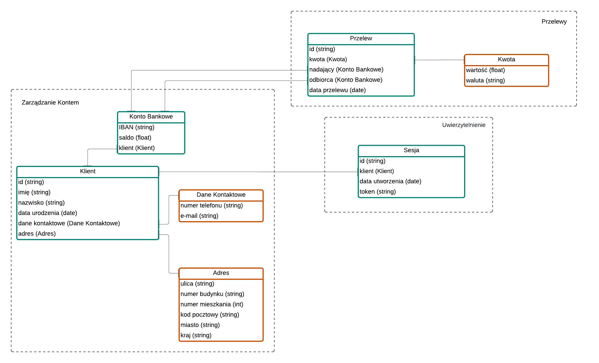

# DDD

Celem zadania jest zamodelowanie fragmentu bezpiecznej aplikacji bankowej, stosując zasady Domain Driven Design (DDD). W ramach zadania zdefiniowano wybrane agregaty, encje i obiekty wartości.

#### Bounded Contexts:
- **Zarządzanie kontem** - Obsługuje dane konta bankowego, historię transakcji i saldo. Odpowiada za rejestrowanie nowych kont oraz aktualizację danych właściciela.
- **Przelewy** - Odpowiada za przetwarzanie i obsługę przelewów między kontami w obrębie banku. Realizuje zasady weryfikacji oraz autoryzacji przelewów.
- **Uwierzytelnianie** - Zajmuje się logowaniem oraz uwierzytelnianiem użytkowników, zapewniając odpowiednie poziomy dostępu do funkcji aplikacji.

#### Założenia
|  Obiekt         | Typ             | Atrybuty  | Opis |
| --------------- |:---------------:| ---------:| ---: |
| Przelew         | Encja (Agregat) | <table><tbody> <tr><td>id</td><td>string</td></tr> <tr><td>kwota</td><td>Kwota</td></tr> <tr><td>nadający</td>  <td>Konto Bankowe</td></tr> <tr><td>odbiorca</td>  <td>Konto Bankowe</td></tr> <tr><td>data przelewu</td>  <td>date</td></tr> </tbody>  </table>  | Reprezentuje pojedynczy przelew między kontami, przechowuje informacje o kwocie, dacie oraz stanie transakcji. |
| Kwota           | Obiekt wartości | <table><tbody> <tr><td>wartość</td><td>float, dokładność 2 miejsca po przecinku</td></tr> <tr><td>waluta</td><td>string o długości 3 (kod zgodny z ISO 4217)</td></tr> </tbody>  </table> | Reprezentuje kwotę przelewu wraz z walutą, zapewnia walidację wartości. |
| Konto Bankowe   | Encja (Agregat) | <table><tbody> <tr><td>IBAN</td><td>string o długości 34, 2 pierwsze znaki to litery (ISO 3166-1 alpha-2), pozostałe to cyfry</td></tr> <tr><td>saldo</td><td>float, dokładność 2 miejsca po przecinku</td></tr> <tr><td>klient</td><td>Klient</td></tr> </tbody>  </table> | Konto bankowe jest powiązane z klientem i przechowuje saldo. |
| Klient          | Encja           | <table><tbody> <tr><td>id</td><td>string</td></tr> <tr><td>imię</td><td>string</td></tr> <tr><td>nazwisko</td><td>string</td></tr> <tr><td>data urodzenia</td><td>date</td></tr></tbody> <tr><td>dane kontaktowe</td><td>Dane Kontaktowe</td></tr> <tr><td>adres</td><td>Adres</td></tr></table> | Klient jest osobą posiadającą konto bankowe, zawiera dane osobowe oraz kontaktowe. |
| Dane kontaktowe | Obiekt wartości | <table><tbody> <tr><td>numer telefonu</td><td>string skadający się z samych cyfr (pozwala na numery kierunkowe zaczynające sie od 0)</td></tr> <tr><td>email</td><td>string</td></tr> </tbody>  </table> | Zawiera dane potrzebne do realizacji przelewu, takie jak numer konta odbiorcy oraz nazwisko. |
| Adres           | Obiekt wartości | <table><tbody> <tr><td>ulica</td><td>string</td></tr> <tr><td>numer bundyku</td><td>string alfanumeryczny (pozwala na numery typu 1A)</td></tr> <tr><td>numer mieszkania</td><td>int</td></tr> <tr><td>kod pocztowy</td><td>string składający się z samych cyft</td></tr> <tr><td>miasto</td><td>string</td></tr> <tr><td>kraj</td><td>string</td></tr> </tbody>  </table> | Reprezentuje adres zamieszkania klienta. |
| Sesja           | Encja (Agregat) | <table><tbody> <tr><td>id</td><td>string</td></tr> <tr><td>klient</td><td>Klient</td></tr> <tr><td>data utworzenia</td><td>date</td></tr> <tr><td>token</td><td>string</td></tr></tbody>  </table> | Służy do przechowywania informacji o zalogowanym kliencie oraz jego uwierzytelnieniu. |